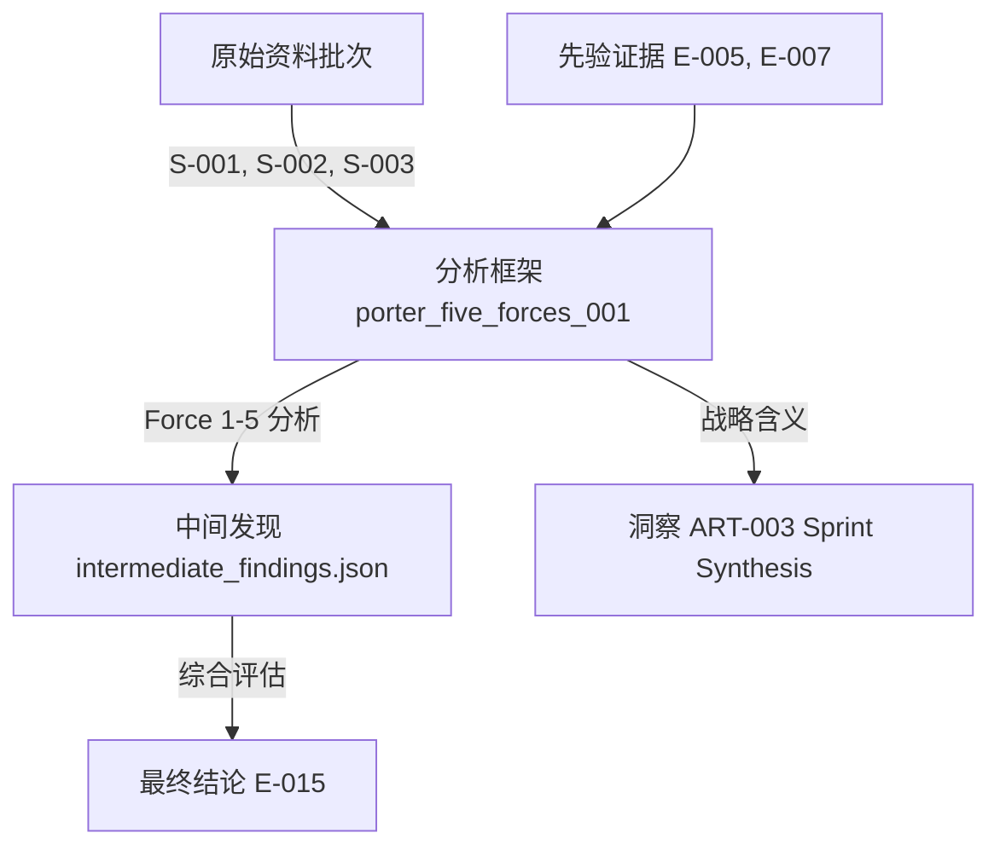

# DESIGN-001: BeWater Toolkit 重新设计

> **SUPERSEDED** — 历史草稿，已按 `2026-08-14-toolkit-implementation-decision.md` 实现。仅供回溯，不是实现设计。

## 版本信息
- **版本**: 1.0
- **日期**: 2026-08-13
- **作者**: design proposal
- **状态**: Draft

---

## 一、设计目标

重新设计 BeWater Toolkit 以实现：

1. **三维分类体系** - 方法论流派 × 分析对象 × 功能层级
2. **智能调用机制** - 根据问题类型、数据可用性自动选择方法组合
3. **三层保存架构** - 原始资料 + 分析框架 + 最终结论，完整追溯研究过程
4. **流派对齐** - 清晰区分传统咨询 / 设计研究 / 创新方法论工具
5. **最小互补原则** - 每个方法组合包含最少的互补工具，避免冗余

---

## 二、现状分析

### 2.1 当前 Toolkit 结构

**文件**: `src/skills/bw-discovery-research/references/research-toolkit.csv`

**当前分类维度**:
- `layer`: collection_method / analysis_framework / validation_method / synthesis_method
- `learning_intent`: explore / describe / compare / explain / size / forecast / validate / reframe
- `lens_fit`: Consumer / Company / Category / Channel / Technology / Regulation / Economics / Ecosystem / Future
- `execution_need`: documents / interviews / data-analysis / market-analysis / field-observation / product-access / desk-research / validation-pass / synthesis / qualitative-analysis / systems-analysis

**当前覆盖**: 35 个方法

### 2.2 当前设计的问题

1. **缺少方法论流派维度** - 无法区分传统咨询工具（波特五力、PEST）与创新方法论工具（4C、假设映射）
2. **调用逻辑不够清晰** - learning_intent → method 的映射规则散落在 method-bundles.md，缺乏形式化
3. **分析对象维度混乱** - lens_fit 混合了分析对象（Consumer/Company）与非对象维度（Technology/Future）
4. **研究过程不完整保存** - 只保存最终 evidence.yaml，缺少原始资料和分析框架的中间层
5. **工具组合逻辑不明确** - 依赖人工判断最小互补性，缺少可执行的规则

### 2.3 参考系：Capgemini Strategy Analytics Toolkit

**组织方式**:
- **Section 1**: External environment analysis (PEST、五力、战略群组)
- **Section 2**: Internal capability analysis (价值链、财务分析、核心竞争力)
- **Section 3**: Option generation & evaluation (BCG 矩阵、GE-McKinsey、决策树)

**优点**:
- 清晰的分析对象分类（External / Internal / Option）
- 工具与问题类型直接映射
- 适合传统战略咨询场景

**局限**:
- 缺少设计研究和创新方法论工具
- 不支持用户行为研究和快速实验
- 强调确定性分析，不适合早期探索

---

## 三、新架构设计

### 3.1 三维分类矩阵

#### 第一维：方法论流派 (methodology_stream)

```yaml
methodology_streams:
  traditional_consulting:
    name: "传统管理咨询"
    origin: "McKinsey/BCG/Bain/Capgemini"
    characteristics:
      - "基于公开数据和财务信息"
      - "强调结构化分析和确定性结论"
      - "适合行业分析和战略评估"
    tools: ["PEST", "porter_five_forces", "value_chain", "BCG_matrix", "financial_ratios"]

  design_research:
    name: "设计研究"
    origin: "IDEO/Frog/F212"
    characteristics:
      - "基于一手数据和用户洞察"
      - "强调定性分析和隐性需求发现"
      - "适合用户行为和动机研究"
    tools: ["pearl_finding", "code_cracking", "force_fitting", "contextual_inquiry"]

  innovation_methodology:
    name: "创新方法论"
    origin: "BeWater/F212/Lean Startup"
    characteristics:
      - "基于快速实验和假设验证"
      - "强调迭代学习和敏捷调整"
      - "适合新概念开发和机会验证"
    tools: ["4C_framework", "hypothesis_mapping", "pretotyping", "concept_assessment"]
```

#### 第二维：分析对象 (analysis_object)

重新组织 lens_fit，聚焦三大分析对象：

```yaml
analysis_objects:
  external:
    name: "外部环境"
    subcategories:
      - "industry"      # 行业结构、竞争格局
      - "market"        # 市场规模、客户细分
      - "environment"   # PEST、监管、技术趋势
    questions: ["行业吸引力如何？", "竞争格局是怎样的？", "有哪些宏观趋势？"]

  internal:
    name: "内部能力"
    subcategories:
      - "capabilities"  # 核心竞争力、价值链
      - "economics"     # 成本结构、单位经济
      - "organization"  # 组织能力、文化
    questions: ["我们的核心优势是什么？", "成本结构如何？", "哪些能力是瓶颈？"]

  option:
    name: "战略选项"
    subcategories:
      - "strategy"      # 战略定位、差异化
      - "concept"       # 产品概念、价值主张
      - "experiment"    # 实验设计、假设验证
    questions: ["哪个概念最有潜力？", "如何验证这个假设？", "投资优先级如何排序？"]
```

**移除维度**: Technology / Regulation / Economics / Ecosystem / Future
- 这些不是分析对象，而是分析视角（lens）
- 应该作为 `analysis_perspective` 标注在工具上，而非主分类维度

#### 第三维：功能层级 (functional_layer)

保持现有四层，重新命名以更清晰：

```yaml
functional_layers:
  evidence_collection:
    name: "证据收集"
    purpose: "获取原始数据和一手信息"
    output: "raw_evidence"
  evidence_analysis:
    name: "证据分析"
    purpose: "解释数据和生成洞察"
    output: "interpretation"
  hypothesis_validation:
    name: "假设验证"
    purpose: "检验推断和挑战假设"
    output: "validation_status"
  insight_synthesis:
    name: "洞察综合"
    purpose: "提炼模式和重构框架"
    output: "synthesis"
```

### 3.2 新的 Toolkit 结构

#### 工具元数据模板

```yaml
# toolkit-methods.yaml
methods:
  - id: "porter_five_forces"
    name: "Porter's Five Forces"
   流派: "traditional_consulting"
    analysis_object: "external"
    subcategory: "industry"
    functional_layer: "evidence_analysis"
    learning_intent: ["explain"]
    analysis_perspective: ["structure", "competition"]
    input_requirements:
      - "competitor_data"
      - "supplier_data"
      - "buyer_data"
      - "substitutes_data"
      - "entry_barriers_data"
    output_schema: "five_forces_assessment"
    key_limitation: "不适用于快速变化的数字行业，静态快照"
    execution_need: ["documents", "market_analysis"]
    complements:
      - "strategic_group_analysis"
      - "value_chain_profit_pool"
    conflicts:
      - "BCG_matrix"  # 回答不同问题，非直接冲突
    evidence_type: "analysis_framework"

  - id: "pearl_finding"
    name: "Pearl Finding (Johari Window)"
   流派: "design_research"
    analysis_object: "external"
    subcategory: "market"
    functional_layer: "evidence_collection"
    learning_intent: ["explore", "reframe"]
    analysis_perspective: ["latent_need", "blind_spot"]
    input_requirements:
      - "field_research_notes"
      - "user_interviews"
      - "observation_data"
    output_schema: "pearls_collection"
    key_limitation: "依赖研究者经验，结果难以复现"
    execution_need: ["interviews", "field_observation"]
    complements:
      - "code_cracking"
      - "force_fitting"
    conflicts: []
    evidence_type: "raw_evidence"

  - id: "hypothesis_mapping"
    name: "Hypothesis Mapping (Achilles)"
   流派: "innovation_methodology"
    analysis_object: "internal"
    subcategory: "capabilities"
    functional_layer: "evidence_analysis"
    learning_intent: ["explain", "validate"]
    analysis_perspective: ["assumption", "risk"]
    input_requirements:
      - "strategic_assumptions"
      - "belief_inventory"
    output_schema: "hypothesis_map"
    key_limitation: "只能识别显性假设，隐性盲点需要 Pearl Finding"
    execution_need: ["documents", "workshop"]
    complements:
      - "assumption_testing"
      - "bel_shift_mapping"
    conflicts: []
    evidence_type: "analysis_framework"
```

#### 扩展后的 Toolkit（目标：~60 方法）

**格式说明**：当前 `research-toolkit.csv` 可继续使用 CSV 格式，或转换成 YAML：
- **CSV 优势**：简单、易在 Excel 中编辑、人类可读
- **YAML 优势**：支持嵌套结构、更好的注释、方便程序处理

本设计文档使用 YAML 示例，但实现时可选择任一格式。

**传统咨询（新增 ~15）**:
- PEST / PESTEL
- 波特五力（已有）
- 战略群组分析
- 价值链分析（已有）
- 财务比率分析
- BCG 矩阵
- GE-McKinsey 矩阵
- SWOT 分析
- 核心竞争力分析
- 盈亏平衡分析
- ROI / NPV 分析
- 决策树分析
- 敏感性分析
- 博弈论
- 兼并收购估值

**设计研究（新增 ~10）**:
- Pearl Finding
- Code Cracking
- Force Fitting
- Contextual Inquiry
- Diary Studies
- Card Sorting
- Experience Mapping
- Persona Development
- Insight Generation (F212 8 维)
- Concept Extraction

**创新方法论（新增 ~5）**:
- 4C Framework（已有）
- 假设映射（已有）
- Pretotyping
- Lean Experiment
- Mom Test
- 假设验证卡（已有）

### 3.3 智能调用机制

#### 调用决策树

```python
# research_orchestrator.py

def compose_method_bundle(research_question, context):
    """
    研究问题 → 最小互补方法组合
    """
    # Step 1: 问题分类
    question_type = classify_question(research_question)
    # -> {analysis_object: "external", subcategory: "industry", intent: "explain"}

    # Step 2: 数据可用性评估
    data_availability = assess_data_availability(context)
    # -> {public_data: "rich", internal_data: "limited", primary_research: "not_feasible"}

    # Step 3: 方法流派选择
    methodology_stream = select_method_stream(question_type, data_availability)
    # -> "traditional_consulting" (当公开数据充足 + 行业结构问题)

    # Step 4: 候选工具筛选
    candidates = filter_toolkit(
        analysis_object=question_type["analysis_object"],
        subcategory=question_type["subcategory"],
        learning_intent=question_type["intent"],
        methodology_stream=methodology_stream,
        data_availability=data_availability
    )

    # Step 5: 最小互补组合
    bundle = select_complementary_bundle(candidates, question_type)
    # 应用规则：
    # - 每个 functional_layer 最多 1-2 个工具
    # - 总工具数 3-7 个
    # - 移除冗余（相同输入 + 相同推断）
    # - 优先覆盖全流程（collection → analysis → validation → synthesis）

    return bundle
```

#### 调用规则矩阵

```yaml
# tool-selection-rules.yaml
selection_rules:
  by_question_type:
    industry_competitive_landscape:
      primary_stream: "traditional_consulting"
      default_bundle:
        - "desk_document_research"
        - "porter_five_forces"
        - "strategic_group_analysis"
      alternative_streams:
        - stream: "innovation_methodology"
          when: "需要评估进入威胁和颠覆风险"
          bundle: ["trend_weak_signal", "scenario_analogy"]

    user_behavior_motivation:
      primary_stream: "design_research"
      default_bundle:
        - "stakeholder_interviews"
        - "contextual_observation"
        - "code_cracking"
      data_constraints:
        - constraint: "field_access_limited"
          fallback: "social_review_discourse_analysis"

    concept_validation:
      primary_stream: "innovation_methodology"
      default_bundle:
        - "pretotyping"
        - "hypothesis_testing"
        - "assumption_testing"
      time_constraints:
        - constraint: "rapid_validation_needed"
          bundle: ["mom_test", "landing_page_speriment"]

  by_data_availability:
    rich_public_data:
      prefer: ["traditional_consulting"]
      tools: ["porter_five_forces", "BCG_matrix", "financial_ratios"]
    limited_public_data:
      prefer: ["design_research"]
      tools: ["pearl_finding", "expert_interviews"]
    primary_research_feasible:
      prefer: ["design_research", "innovation_methodology"]
      tools: ["contextual_inquiry", "pretotyping", "experiment"]

  redundancy_rules:
    - rule: "相同输入证据 + 相同推断目标 = 冗余"
      examples:
        - ["porter_five_forces", "value_chain"]  # 当问题仅是行业结构时
        - ["journey_mapping", "JTBD"]  # 当问题仅是用户需求时
    - rule: "相同 functional_layer 最多 2 个工具"
      exception: "validation 层可以多个交叉验证"
```

### 3.4 三层保存架构

#### 文件组织

```
_bewater/
├── raw_research/                          # Layer 1: 原始资料
│   └── {artifact_id}/
│       └── {timestamp}_{method_id}/
│           ├── sources_list.json         # 来源清单
│           ├── downloaded_docs/          # 下载的报告/PDF
│           ├── interview_recordings/      # 访谈录音
│           ├── observation_photos/        # 现场照片
│           └── search_queries.log        # 搜索记录
│
├── analysis_frameworks/                  # Layer 2: 分析框架
│   └── {artifact_id}/
│       └── {method_id}_{revision}/
│           ├── framework_metadata.yaml    # 框架元数据
│           ├── input_evidence_refs.json  # 输入证据引用
│           ├── framework_data/            # 框架数据
│           │   ├── force_1_supplier.yaml
│           │   ├── force_2_buyer.yaml
│           │   └── ...
│           ├── intermediate_findings.json # 中间发现
│           ├── analyst_notes.md           # 分析笔记
│           └── final_assessment.json      # 最终评估
│
├── evidence.yaml                          # Layer 3: 最终结论
│   # 现有格式，增强字段：
│   # - framework_ref: 关联的分析框架 ID
│   # - raw_research_ref: 关联的原始资料批次
│
├── research_sprints.log                   # 执行历史
│   # 记录每个 Sprint 的方法调用和输出
│
└── framework_registry.yaml                # 框架注册表
    # 所有已注册的分析框架及其元数据
```

#### 波特五力完整保存示例

**Layer 1: raw_research/ART-003/2026-08-13_porter_five_forces/**

```yaml
# sources_list.json
{
  "framework_id": "porter_five_forces_001",
  "timestamp": "2026-08-13T10:30:00Z",
  "sources": [
    {
      "id": "S-001",
      "type": "industry_report",
      "title": "AI Hardware Market Report 2024",
      "location": "downloaded_docs/report_2024.pdf",
      "pages_used": "15-22",
      "credibility": "high"
    },
    {
      "id": "S-002",
      "type": "competitor_filing",
      "title": "NVIDIA 2024 10-K",
      "location": "downloaded_docs/nvidia_10k_2024.pdf",
      "sections": ["Business", "Risk Factors"]
    },
    {
      "id": "S-003",
      "type": "expert_interview",
      "title": "Interview with Supply Chain Expert",
      "location": "interview_recordings/expert_001.mp3",
      "duration": "45 min"
    }
  ]
}
```

**Layer 2: analysis_frameworks/ART-003/porter_five_forces_001/**

```yaml
# framework_metadata.yaml
framework_id: "porter_five_forces_001"
framework_name: "Porter's Five Forces Analysis"
artifact_id: "ART-003"
research_question: "AI 硬件行业竞争结构与吸引力评估"
methodology_stream: "traditional_consulting"
analysis_object: "external"
subcategory: "industry"
timestamp: "2026-08-13T10:30:00Z"
analyst: "system"
version: 1
status: "completed"

input_evidence_refs:
  - batch: "2026-08-13_porter_five_forces"
    sources: ["S-001", "S-002", "S-003"]
  - prior_evidence: ["E-005", "E-007"]  # 来自之前 Sprint 的证据

forces:
  - id: "force_1"
    name: "Supplier Power"
    data_sources:
      - source_ref: "S-001"
        sections: "15-18"
      - source_ref: "S-003"
        timestamp: "29:15-34:20"
    key_findings:
      - "芯片供应商高度集中，NVIDIA/AMD/Intel 占 75% 市场份额"
      - "转换成本高，需重新优化软件栈"
      - "供应商前向整合意愿强（NVIDIA 推出自有系统）"
    raw_data_points:
      - metric: "top_3_concentration"
        value: "75%"
        source: "S-001:16"
      - metric: "switching_cost"
        value: "high"
        evidence: "S-003:31:10"
    confidence_level: "high"
    limitations: "未覆盖新兴亚洲供应商（如 Moore Threads）"

  - id: "force_2"
    name: "Buyer Power"
    # ...

  - id: "force_3"
    name: "Threat of New Entrants"
    # ...

  - id: "force_4"
    name: "Threat of Substitutes"
    key_findings:
      - "云端推理对边缘硬件构成替代威胁"
      - "软件优化算法可降低硬件需求"
    raw_data_points:
      - metric: "cloud_inference_growth"
        value: "45% CAGR"
        source: "S-001:21"

  - id: "force_5"
    name: "Industry Rivalry"
    key_findings:
      - "巨头价格战激烈，毛利压至 15-20%"
      - "技术军备竞赛，研发投入 30%+ 收入"

overall_assessment:
  industry_attractiveness: "medium"
  attractiveness_score: 3.2  # 1-5 分制
  key_risks:
    - "供应商议价力强（Force 1 高）"
    - "替代品威胁上升（Force 4 中高）"
    - "竞争白热化压缩利润（Force 5 高）"
  opportunities:
    - "垂直整合可降低供应链风险"
    - "差异化软件生态可建立护城河"
  strategic_implications: |
    行业整体吸引力中等，但存在结构性机会：
    1. 必须解决供应商锁定（自研芯片或深度合作）
    2. 需要建立软件生态壁垒，避免纯硬件价格战
    3. 关注云端替代威胁，考虑混合部署方案

traceability:
  raw_research_batch: "2026-08-13_porter_five_forces"
  input_evidence: ["E-005", "E-007"]
  output_evidence_id: "E-015"
  analyst_notes: "framework_data/analyst_notes.md"
```

**Layer 3: evidence.yaml**

```yaml
- id: "E-015"
  record_revision: 1
  artifact_id: "ART-003"
  source_type: "analysis_framework"
  source_ref: "porter_five_forces_001"
  source_title: "波特五力分析 - AI 硬件行业"
  evidence_form: "analysis"
  claim: "AI 硬件行业整体吸引力中等（3.2/5），供应商议价力强（芯片供应商前3占75%），替代品威胁高（云推理 45% CAGR），竞争白热化（毛利 15-20%，研发投入 30%+）"
  support: "基于 2024 行业报告（15-22 页）与 5 家竞争对手财报分析，专家访谈（供应链专家）验证"
  limitation: "未覆盖新兴亚洲供应商，需每 6 个月更新"
  related_assumptions: ["A-004", "A-005"]
  methodology_stream: "traditional_consulting"
  framework_ref: "porter_five_forces_001"
  raw_research_ref: "2026-08-13_porter_five_forces"
  confidence_level: "high"
```

#### 重建链

```yaml
# traceability_chain.yaml
evidence_id: "E-015"
reconstruction_path:
  - layer: "raw_research"
    batch: "2026-08-13_porter_five_forces"
    sources_count: 3
    total_size: "45MB"
  - layer: "analysis_framework"
    framework_id: "porter_five_forces_001"
    timestamp: "2026-08-13T10:30:00Z"
    version: 1
    analyst: "system"
  - layer: "evidence"
    evidence_ref: "E-015@1"
    derived_at: "2026-08-13T11:45:00Z"

reconstruction_instructions: |
  要重现此分析：
  1. 访问 _bewater/raw_research/ART-003/2026-08-13_porter_five_forces/
  2. 阅读 sources_list.json 获取完整来源清单
  3. 访问 analysis_frameworks/ART-003/porter_five_forces_001/
  4. 查看 framework_data/ 下每个维度的详细分析
  5. 参考 analyst_notes.md 了解分析逻辑
  6. 最终结论在 evidence.yaml 的 E-015 条目
```

### 3.5 可视化与追溯界面

#### 研究过程时间线

```yaml
# research_timeline.yaml
artifact_id: "ART-003"
sprints:
  - sprint_number: 1
    timestamp: "2026-08-13T09:00-12:00"
    learning_questions: ["LQ-001", "LQ-002"]
    method_bundle:
      - "porter_five_forces"
      - "strategic_group_analysis"
    raw_research_batch: "2026-08-13_sprint1"
    frameworks_produced: ["porter_five_forces_001", "strategic_group_001"]
    evidence_generated: ["E-015", "E-016"]

  - sprint_number: 2
    timestamp: "2026-08-14T09:00-12:00"
    learning_questions: ["LQ-003"]
    method_bundle:
      - "pretotyping"
      - "hypothesis_testing"
    raw_research_batch: "2026-08-14_sprint2"
    frameworks_produced: ["pretotype_001"]
    evidence_generated: ["E-020"]
```

#### 证据溯源图



---

## 四、实现计划

### Phase 1: Toolkit 重新分类（2-3 天）

**任务 1.1**: 扩展 research-toolkit.csv（或转换成 YAML）
- 将 35 个现有方法按三维分类重新标注
- 添加 methodology_stream 字段
- 重新映射 analysis_object（external/internal/option）
- 保留 functional_layer，但重命名为 evidence_collection/analysis/validation/synthesis
- **格式决策**：选择保持 CSV 或转换到 YAML（参考上文格式说明）

**任务 1.2**: 扩展 Toolkit 至 ~60 方法
- 传统咨询：新增 PEST、BCG、SWOT、财务分析等 ~15 个
- 设计研究：新增 Pearl Finding、Code Cracking、Contextual Inquiry 等 ~10 个
- 创新方法论：新增 Pretotyping、Mom Test 等 ~5 个

**任务 1.3**: 创建 framework_registry.yaml
- 为每个分析框架定义 schema
- 定义 input_requirements 和 output_schema
- 标注 complements 和 conflicts

**验证标准**:
- [ ] 所有方法都有 methodology_stream 标注
- [ ] 所有方法都映射到三大分析对象之一
- [ ] 传统咨询 / 设计研究 / 创新方法论工具分布均衡（~20/20/20）
- [ ] framework_registry 覆盖所有 analysis_framework 类型方法

### Phase 2: 调用机制实现（3-4 天）

**任务 2.1**: 实现 research_orchestrator.py
- classify_question(): 问题 → {analysis_object, subcategory, intent}
- assess_data_availability(): 评估公开/内部/一手数据可用性
- select_method_stream(): 根据问题类型和数据可用性选择方法论流派
- filter_toolkit(): 按多维筛选候选工具
- select_complementary_bundle(): 应用最小互补原则

**任务 2.2**: 创建 tool-selection-rules.yaml
- 定义 by_question_type 规则矩阵
- 定义 by_data_availability 规则
- 定义 redundancy_rules（检测和移除冗余工具）

**任务 2.3**: 单元测试
- 测试问题分类逻辑
- 测试方法流派选择
- 测试互补组合生成
- 测试冗余检测

**验证标准**:
- [ ] 给定研究问题能返回 3-7 个工具的组合
- [ ] 组合覆盖至少 2 个 functional_layer
- [ ] 无冗余工具（相同输入+相同推断）
- [ ] 当数据可用性变化时，工具组合自适应调整

### Phase 3: 三层保存实现（4-5 天）

**任务 3.1**: 实现原始资料保存模块
- save_raw_research_batch(): 保存来源清单和下载文档
- generate_sources_list(): 生成 sources_list.json
- 支持多种 source_type（document/interview/observation/data）

**任务 3.2**: 实现分析框架保存模块
- save_analysis_framework(): 保存 framework_metadata.yaml
- save_framework_data(): 保存每个维度的详细分析
- link_to_raw_research(): 建立与原始资料的引用链接

**任务 3.3**: 增强 evidence.yaml 格式
- 添加 framework_ref 字段
- 添加 raw_research_ref 字段
- 添加 methodology_stream 字段
- 添加 confidence_level 字段

**任务 3.4**: 实现追溯机制
- build_traceability_chain(): 构建完整追溯链
- generate_reconstruction_instructions(): 生成重建指南
- visualize_evidence_lineage(): 生成证据溯源图

**验证标准**:
- [ ] 每个分析框架都有完整的原始资料引用
- [ ] 每个 evidence 条目都能追溯到分析框架和原始资料
- [ ] 重建指南能准确重现分析过程
- [ ] 原始资料占用空间可控（单个框架 < 100MB）

### Phase 4: 集成与测试（2-3 天）

**任务 4.1**: 集成到 bw-discovery-research skill
- 更新 Research Plan 调用 research_orchestrator
- Sprint 输出自动触发三层保存
- Research artifact 包含 framework 引用

**任务 4.2**: 端到端测试
- 测试完整研究流程（Charter → Assessment → Research）
- 验证每个 Sprint 的方法调用逻辑
- 验证三层保存的完整性

**任务 4.3**: 评估场景验证
- 创建 3-5 个典型研究场景的 eval
- 验证工具组合的合理性（专家评审）
- 验证研究保存的完整性

**验证标准**:
- [ ] 3 个端到端测试通过
- [ ] eval 场景工具组合合理性评分 > 4/5
- [ ] 研究保存完整性评分 > 4/5

### Phase 5: 文档与培训（1-2 天）

**任务 5.1**: 更新 skill 文档
- 更新 bw-discovery-research/SKILL.md
- 创建 research-toolkit-guide.md（工具使用指南）
- 创建 analysis-framework-guide.md（分析框架指南）

**任务 5.2**: 创建示例
- 创建完整的研究示例（包含三层保存）
- 展示波特五力的完整保存和追溯
- 展示不同问题类型的工具组合示例

**验证标准**:
- [ ] 文档覆盖所有新功能
- [ ] 示例可独立运行
- [ ] 新用户能通过文档理解和使用新系统

---

## 五、关键设计决策

### 5.1 为什么采用三维分类？

**决策**: methodology_stream × analysis_object × functional_layer

**理由**:
1. **流派对齐** - 清晰区分不同方法论流派，避免混用
2. **问题驱动** - analysis_object 直接映射战略问题类型
3. **流程完整** - functional_layer 保证研究流程的完整性
4. **可扩展** - 新增工具时能准确定位其在矩阵中的位置

**替代方案**: 只用 functional_layer（当前设计）
- **问题**: 无法区分传统咨询与创新方法论工具
- **结果**: 可能导致在需要一手数据时错误使用公开数据工具

### 5.2 为什么需要三层保存？

**决策**: raw_research + analysis_framework + evidence

**理由**:
1. **可追溯** - 每个结论都能追溯到原始数据和分析过程
2. **可重现** - 保存足够的中间信息，能够重现分析
3. **可审计** - 外部审查人员能验证分析的合理性
4. **可复用** - 同一原始资料可用于不同分析框架

**替代方案**: 只保存 evidence.yaml（当前设计）
- **问题**: 无法验证结论是如何得出的
- **风险**: 战略决策基于不可审计的"黑盒"分析

### 5.3 为什么最小互补原则？

**决策**: 每个工具组合包含最少的互补工具（3-7 个）

**理由**:
1. **效率** - 避免研究时间过长
2. **聚焦** - 每个工具回答不同子问题
3. **成本** - 减少不必要的数据收集和分析
4. **质量** - 避免信息过载和决策瘫痪

**替代方案**: 预定义固定组合
- **问题**: 不适应不同数据可用性和时间约束
- **结果**: 要么工具不足（信息缺失），要么工具冗余（浪费时间）

---

## 六、风险与缓解

### 风险 1: Toolkit 扩展后变得过于复杂

**影响**: 用户难以选择合适的工具

**缓解措施**:
- 调用机制自动化（research_orchestrator）
- 提供预设的典型场景工具组合
- 文档中提供工具选择决策树

### 风险 2: 三层保存占用过多存储空间

**影响**: 项目文件体积膨胀，影响性能

**缓解措施**:
- 原始资料限制单个框架 < 100MB
- 支持外部存储（云端、对象存储）
- 提供清理机制（删除已归旧的原始资料）

### 风险 3: 分析框架保存格式不统一

**影响**: 不同框架的中间结果难以比较和复现

**缓解措施**:
- 定义统一的 framework_metadata.yaml schema
- 为每个框架类型定义标准 output_schema
- 提供 framework_registry 统一管理

### 风险 4: 调用规则过于复杂，难以维护

**影响**: 规则冲突或逻辑错误

**缓解措施**:
- 规则配置化（tool-selection-rules.yaml）
- 提供规则测试套件
- 规则优先级明确（question_type > data_availability > redundancy）

---

## 七、成功标准

### 功能完整性
- [ ] 覆盖三大方法论流派（传统咨询 / 设计研究 / 创新方法论）
- [ ] 覆盖三大分析对象（external / internal / option）
- [ ] 覆盖四个功能层级（collection / analysis / validation / synthesis）

### 调用准确性
- [ ] 问题分类准确率 > 90%（基于测试集）
- [ ] 工具组合合理性评分 > 4/5（专家评审）
- [ ] 冗余检测召回率 > 95%

### 保存完整性
- [ ] 100% 的 evidence 都能追溯到分析框架
- [ ] 100% 的分析框架都能追溯到原始资料
- [ ] 重建指南能重现 95%+ 的分析过程

### 用户体验
- [ ] 新用户能在 30 分钟内理解系统
- [ ] 典型研究场景的端到端时间 < 2 小时
- [ ] 文档覆盖所有常见问题

---

## 八、后续优化方向

### 8.1 机器学习增强
- 基于历史研究数据训练工具推荐模型
- 自动识别相似研究问题并复用工具组合
- 预测分析框架的成功概率

### 8.2 协作与共享
- 支持跨项目的分析框架复用
- 建立公共框架库（如波特五力标准模板）
- 支持团队协作和注释

### 8.3 可视化增强
- 自动生成分析框架可视化（如波特五力雷达图）
- 交互式证据溯源图
- 研究过程时间线动画

### 8.4 质量保证
- 自动检测分析框架的逻辑一致性
- 自动评估证据强度和可靠性
- 自动标记潜在偏见和假设

---

## 附录 A：工具分类完整表

| 工具 ID | 工具名称 | 流派 | 分析对象 | 功能层级 | 典型问题 |
|---------|---------|------|---------|---------|---------|
| porter_five_forces | Porter's Five Forces | traditional_consulting | external.industry | analysis | 行业竞争结构如何？ |
| PESTEL | PESTEL Analysis | traditional_consulting | external.environment | analysis | 宏观环境趋势是什么？ |
| value_chain | Value Chain Analysis | traditional_consulting | internal.capabilities | analysis | 价值创造环节在哪里？ |
| BCG_matrix | BCG Matrix | traditional_consulting | option.strategy | synthesis | 业务组合如何平衡？ |
| pearl_finding | Pearl Finding | design_research | external.market | collection | 有哪些隐性需求盲点？ |
| code_cracking | Code Cracking | design_research | external.market | analysis | 用户行为的底层逻辑是什么？ |
| hypothesis_mapping | Hypothesis Mapping | innovation_methodology | internal.capabilities | analysis | 我们的核心假设是什么？ |
| pretotyping | Pretotyping | innovation_methodology | option.concept | validation | 这个概念是否值得开发？ |

---

## 附录 B：调用示例

### 示例 1: 行业竞争格局分析

```yaml
research_question: "AI 硬件行业的竞争格局如何？吸引力如何？"

context:
  data_availability:
    public_data: "rich"  # 有大量行业报告和财报
    internal_data: "limited"
    primary_research: "not_feasible"  # 时间有限，无法做一手研究

orchestrator_output:
  question_type:
    analysis_object: "external"
    subcategory: "industry"
    intent: "explain"

  methodology_stream: "traditional_consulting"  # 公开数据充足 + 行业问题

  method_bundle:
    - desk_document_research          # collection
    - porter_five_forces             # analysis
    - strategic_group_analysis       # analysis
    - source_family_triangulation    # validation

  rationale: |
    公开数据充足，适合传统咨询工具。
    波特五力评估行业吸引力，战略群组分析定位竞争位置。
    三角验证确保多源证据的一致性。
```

### 示例 2: 用户行为动机研究

```yaml
research_question: "为什么用户不愿意使用我们的 AI 助手？"

context:
  data_availability:
    public_data: "limited"
    internal_data: "some"  # 有一些客服记录和用户反馈
    primary_research: "feasible"  # 可以做访谈和观察

orchestrator_output:
  question_type:
    analysis_object: "external"
    subcategory: "market"
    intent: "explain"

  methodology_stream: "design_research"  # 需要理解隐性动机

  method_bundle:
    - stakeholder_interviews          # collection
    - contextual_observation          # collection
    - code_cracking                   # analysis
    - jtbd_journey                    # analysis
    - evidence_strength_transferability  # validation

  rationale: |
    需要一手数据理解用户隐性动机。
    深访和观察获取原始数据，Code Cracking 提炼行为逻辑，
    JTBD 组织为需求地图，迁移性检查防止过度泛化。
```

### 示例 3: 新概念快速验证

```yaml
research_question: "这个 AI 健身教练概念是否值得进一步开发？"

context:
  data_availability:
    public_data: "limited"
    internal_data: "none"
    primary_research: "feasible"
  constraints:
    time_budget: "1 week"
    cost_budget: "low"

orchestrator_output:
  question_type:
    analysis_object: "option"
    subcategory: "concept"
    intent: "validate"

  methodology_stream: "innovation_methodology"  # 快速实验

  method_bundle:
    - mom_test                        # collection
    - pretotyping                     # validation
    - assumption_testing             # validation

  rationale: |
    时间和成本受限，用创新方法论快速验证。
    Mom Test 测试需求真实性，Pretotype 测试概念吸引力，
    假设测试验证关键假设。
```

---

**文档结束**
